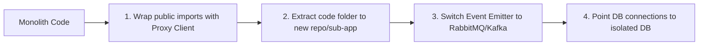

# Modular Monolith Architecture Guidelines

This document outlines the architectural standards and guidelines for the **Aruli-Marketplace** backend. Our backend is designed as a **Modular Monolith**: a single deployable application constructed from highly independent, loosely-coupled domain modules. This layout ensures we maintain a clean separation of concerns and can easily migrate individual domains to dedicated **microservices** as the system scales.

---

## 1. Directory Structure per Module

Each domain module lives in `src/modules/<module-name>/` and must maintain standard boundaries:

```text
src/modules/<module-name>/
├── <module-name>.module.ts       # Module entry point (exports public service interface)
├── domain/                       # Core business logic (pure, framework-agnostic)
│   ├── entities/                 # Database tables or domain entities
│   └── interfaces/               # Repository and gateway interfaces
├── application/                  # Use cases and services orchestrating logic
│   └── <module-name>.service.ts  # Primary service orchestration
├── infrastructure/               # Framework implementations (controllers, database, clients)
│   ├── controllers/              # HTTP or microservice controllers
│   ├── repositories/             # Database-specific repository implementations
│   └── dto/                      # Data Transfer Objects for requests/responses
```

---

## 2. Core Architectural Rules

To prevent our modular monolith from decaying into a "spaghetti monolith," we strictly enforce the following rules:

### Rule 1: Database Boundary Isolation
* **No Database Joins Across Domains:** You must never write SQL or ORM queries that join tables belonging to different modules. (For example, `Orders` must not perform a database join with `Users` or `Products`).
* **ID-Only References:** If an entity needs to reference another entity in a different module, reference it *only* by its ID (e.g., `userId: string` or `productId: string`), not by an ORM relation (e.g., `@ManyToOne(() => User)` is forbidden across module boundaries).
* **Data Fetching:** If `OrdersModule` needs user details, it must query the `UsersService` programmatically or retrieve it asynchronously.

### Rule 2: Synchronous Communication via Public Interfaces
* If Module A needs data from Module B synchronously, it must import Module B's module wrapper in `A.module.ts` and inject Module B's primary **Service/Facade** (e.g., `UsersService`).
* Never import internal files, controllers, repositories, or helpers of another module directly.
* Keep the API surface of each module's service as small as possible.

### Rule 3: Asynchronous Communication via Events
* For side-effects and cross-module processes (like updating inventory after an order, or sending a welcome email after registration), use **domain events**.
* We use `@nestjs/event-emitter` for in-memory event publishing.
* Modules should publish an event (e.g., `OrderPlacedEvent`) and let other modules subscribe to it asynchronously. The publishing module must not know who is listening.

---

## 3. Communication Patterns

```mermaid
graph TD
    subgraph Synchronous (Direct Service Injections)
        OrdersService -->|injects & calls| CatalogService
    end

    subgraph Asynchronous (Event-Driven - Recommended)
        OrdersService2[OrdersService] -->|publishes| Event["'order.placed' Event"]
        Event -->|triggers| InventoryListener[Inventory Module Listener]
        Event -->|triggers| EmailListener[Notifications Module Listener]
    end
```

### Example: Publishing an Event
```typescript
import { EventEmitter2 } from '@nestjs/event-emitter';

@Injectable()
export class OrdersService {
  constructor(private eventEmitter: EventEmitter2) {}

  async createOrder(dto: CreateOrderDto) {
    // 1. Process order creation logic...
    const order = await this.orderRepository.save(newOrder);

    // 2. Emit event asynchronously
    this.eventEmitter.emit('order.placed', new OrderPlacedEvent(order));
    
    return order;
  }
}
```

---

## 4. How to Migrate a Module to a Microservice

When a module (e.g., `payments` or `notifications`) needs to scale independently or be managed by a separate team, it can be extracted with minimal friction by following this roadmap:



### Step 1: Wrap the Module Service
Ensure the target module is accessed only through its public service interface. Create an interface definition if not already present.

### Step 2: Extract the Code Folder
Move `src/modules/<module-name>` into its own Git repository or a separate NestJS application folder.

### Step 3: Implement Remote Procedure Calls (RPC)
In the Monolith, replace the local service implementation with a client proxy (e.g., using NestJS Microservice Clients for gRPC, TCP, or HTTP REST) that calls the newly extracted microservice. The code importing the service will not need to change its signatures.

### Step 4: Swap the Event Bus
Transition the event publisher/listener from the local `@nestjs/event-emitter` to a message broker like **RabbitMQ**, **Kafka**, or **AWS SNS/SQS** (NestJS has native transport microservice layers for these).

### Step 5: Isolate the Database
Migrate the domain's tables to a separate database schema/instance. Since database joins were forbidden, this step will not break any queries.
